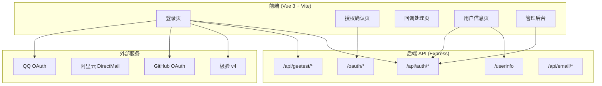

# ZJSSO 统一登录门户 - 技术架构文档

## 1. 架构设计



## 2. 技术说明

- **前端框架**：Vue 3 + Composition API + Vite 5
- **路由**：vue-router@4（hash 模式）
- **HTTP 客户端**：原生 fetch（封装请求拦截器）
- **状态管理**：Pinia（用户 session、Token 管理）
- **UI 组件**：无 UI 框架，纯手写 CSS（独立设计风格）
- **图标**：Font Awesome 6（CDN 引入）
- **构建工具**：Vite 5
- **部署**：独立部署，开发时在后端配置 CORS

## 3. 路由定义

| 路由 | 名称 | 用途 |
|------|------|------|
| `/login` | Login | 用户登录、注册、找回密码 |
| `/authorize` | Authorize | OIDC 授权确认（用户确认 scope） |
| `/callback` | Callback | OAuth 授权回调处理 |
| `/profile` | Profile | 个人资料、WebAuthn 凭证、社交绑定 |
| `/admin` | Admin | 管理后台（客户端管理 + 用户管理） |

## 4. API 对接

所有 API 调用基于后端 `http://localhost:3000`：

| 端点 | 方法 | 用途 |
|------|------|------|
| `/api/auth/login` | POST | 用户登录 |
| `/api/auth/register` | POST | 用户注册 |
| `/api/auth/logout` | POST | 退出登录 |
| `/api/auth/refresh` | POST | 刷新 Token |
| `/api/auth/check-available` | GET | 检查用户名/邮箱可用性 |
| `/api/geetest/register` | POST | 获取极验初始化参数 |
| `/oauth/authorize` | GET | 发起 OIDC 授权 |
| `/userinfo` | GET | 获取用户信息 |
| `/api/email/send-activation` | POST | 发送激活邮件 |
| `/api/email/send-reset-password` | POST | 发送重置密码邮件 |
| `/api/email/verify-activation` | GET | 验证激活码 |
| `/api/email/reset-password` | POST | 重置密码 |
| `/api/webauthn/*` | - | WebAuthn 凭证管理 |
| `/api/user/social/connections` | GET/DELETE | 社交账号绑定管理 |

## 5. 数据模型

### 5.1 前端 Store 模型

```typescript
// 用户 Session
interface UserSession {
  access_token: string;
  refresh_token: string;
  id_token: string;
  expires_in: number;
  user: {
    id: string;
    username: string;
    email: string;
    display_name: string;
    picture: string | null;
    role: 'user' | 'developer' | 'admin';
  };
}

// OIDC 授权参数
interface OAuthParams {
  client_id: string;
  redirect_uri: string;
  response_type: string;
  scope: string;
  state: string;
  nonce?: string;
  code_challenge?: string;
  code_challenge_method?: string;
}
```

## 6. 目录结构

```
frontend/
├── index.html
├── package.json
├── vite.config.js
├── src/
│   ├── main.js
│   ├── App.vue
│   ├── router/
│   │   └── index.js
│   ├── stores/
│   │   └── auth.js          # Pinia 认证 store
│   ├── views/
│   │   ├── Login.vue        # 登录/注册/找回密码
│   │   ├── Authorize.vue    # OIDC 授权确认
│   │   ├── Callback.vue     # 回调处理
│   │   ├── Profile.vue      # 个人中心
│   │   └── Admin.vue        # 管理后台
│   ├── components/
│   │   ├── LoginForm.vue    # 登录表单
│   │   ├── RegisterForm.vue # 注册表单
│   │   ├── ResetPassword.vue # 找回密码
│   │   ├── NavBar.vue       # 顶部导航栏
│   │   └── AdminSidebar.vue # 管理后台侧边栏
│   └── utils/
│       └── api.js           # API 请求封装
```
