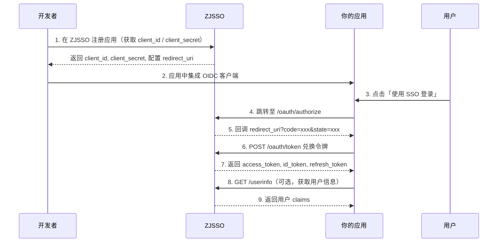

# ZJSSO OIDC 客户端对接文档

> 本文档面向需要对接 ZJSSO 单点登录系统的第三方应用开发者（Relying Party / RP）。
> 涵盖 OIDC 标准协议流程、客户端注册、认证 API、会话管理及安全最佳实践。

---

## 目录

1. [概述](#1-概述)
2. [快速开始](#2-快速开始)
3. [客户端注册与管理](#3-客户端注册与管理)
4. [OIDC 标准协议流程](#4-oidc-标准协议流程)
5. [认证 API（第一方应用）](#5-认证-api第一方应用)
6. [会话管理](#6-会话管理)
7. [UserInfo](#7-userinfo)
8. [登出](#8-登出)
9. [安全最佳实践](#9-安全最佳实践)
10. [错误处理](#10-错误处理)
11. [完整代码示例](#11-完整代码示例)

---

## 1. 概述

### 1.1 系统角色

| 角色 | 说明 |
|------|------|
| **ZJSSO (OP/IdP)** | 授权服务器 / OpenID Provider，本系统 |
| **客户端 (RP)** | 你的应用（Web / 移动端 / 后端服务），需要对接 SSO |
| **终端用户** | 在你的应用中使用 ZJSSO 登录的用户 |

### 1.2 支持的协议

- **OIDC Authorization Code Flow**（含 PKCE）：推荐用于所有类型的应用
- **OIDC Authorization Code Flow + PKCE**：公开客户端的强制要求
- **Refresh Token Rotation**：refresh_token 一次性使用，轮换机制
- **Client Credentials**：服务器到服务器的 M2M 通信

### 1.3 基础地址

```
# 生产环境
ISSUER = https://sso.haoziwan.cn

# 开发环境（本地）
ISSUER = http://localhost:6873
```

以下文档以 `ISSUER` 作为占位符。请根据实际环境替换。

---

## 2. 快速开始

### 2.1 四步接入



---

## 4. OIDC 标准协议流程

### 4.1 发现端点

用于动态发现 ZJSSO 支持的 OIDC 配置。

```
GET /.well-known/openid-configuration
```

**响应（部分）：**

```json
{
  "issuer": "http://localhost:6873",
  "authorization_endpoint": "http://localhost:6873/oauth/authorize",
  "token_endpoint": "http://localhost:6873/oauth/token",
  "userinfo_endpoint": "http://localhost:6873/userinfo",
  "jwks_uri": "http://localhost:6873/.well-known/jwks.json",
  "scopes_supported": ["openid", "profile", "email", "phone", "offline_access", "groups"],
  "response_types_supported": ["code"],
  "grant_types_supported": ["authorization_code", "refresh_token", "client_credentials"],
  "token_endpoint_auth_methods_supported": ["client_secret_basic", "client_secret_post", "none"],
  "code_challenge_methods_supported": ["S256", "plain"],
  "id_token_signing_alg_values_supported": ["RS256", "HS256"]
}
```

### 4.2 JWKS 端点

获取 ZJSSO 的 RSA 公钥，用于验证 id_token 的签名。

```
GET /.well-known/jwks.json
```

### 4.3 授权端点（Authorization Code Flow）

这是最核心的端点，用于将用户重定向到 ZJSSO 的登录页。

```
GET /oauth/authorize?response_type=code&client_id={client_id}&redirect_uri={redirect_uri}&scope=openid%20profile%20email&state={state}&code_challenge={code_challenge}&code_challenge_method=S256
```

**请求参数：**

| 参数 | 必填 | 说明 |
|------|------|------|
| `response_type` | 是 | 固定为 `code` |
| `client_id` | 是 | 注册时获取的 client_id |
| `redirect_uri` | 是 | 必须与注册时配置的完全匹配 |
| `scope` | 是 | 必须包含 `openid`。可选：`profile`, `email`, `phone`, `offline_access`, `groups` |
| `state` | 是 | CSRF 防护，回调原样返回。建议使用随机字符串 |
| `code_challenge` | 推荐 | PKCE 的 code_challenge（S256 哈希） |
| `code_challenge_method` | 推荐 | `S256`（推荐）或 `plain` |
| `nonce` | 否 | 防止重放攻击，id_token 中包含此值 |
| `prompt` | 否 | `none`（静默检查，已登录则返回 code，否则返回 `login_required` 错误） |

**Scope 权限说明：**

| Scope | 返回的 Claims | 说明 |
|-------|--------------|------|
| `openid` | `sub` | **必须**，用户的唯一标识 |
| `profile` | `name`, `preferred_username`, `picture`, `locale`, `qq`, `role`, `groups` | 基本信息 |
| `email` | `email`, `email_verified` | 邮箱地址及验证状态 |
| `phone` | `phone` | 手机号码 |
| `offline_access` | refresh_token | 授权码流程中颁发 refresh_token |
| `groups` | 包含在 profile 中 | 用户所属组信息 |

**流程说明：**

1. **用户未登录时**：ZJSSO 将用户重定向至登录页，登录完成后自动跳回授权页
2. **用户已登录时**：显示授权确认页（首次），用户授权后跳转回 `redirect_uri`
3. **已授权过**：跳过确认页，直接返回授权码

**成功回调：**

```
{redirect_uri}?code={authorization_code}&state={state}
```

**失败回调：**

```
{redirect_uri}?error=access_denied&error_description=...&state={state}
```

### 4.4 Token 端点

使用授权码兑换令牌。

```
POST /oauth/token
Content-Type: application/x-www-form-urlencoded
```

**授权码模式：**

| 参数 | 必填 | 说明 |
|------|------|------|
| `grant_type` | 是 | `authorization_code` |
| `code` | 是 | 授权端点返回的 code |
| `redirect_uri` | 是 | 必须与授权请求一致 |
| `code_verifier` | 条件 | 如果授权请求使用了 PKCE，则需要提供 |
| `client_id` | 条件 | 见客户端认证说明 |
| `client_secret` | 条件 | 见客户端认证说明 |

**客户端认证方式：**

- **`client_secret_basic`**（推荐）：在 `Authorization` 头中使用 Basic Auth
  ```
  Authorization: Basic base64(client_id:client_secret)
  ```
- **`client_secret_post`**：将 `client_id` 和 `client_secret` 放在请求体中
- **`none`**：仅限公开客户端，必须使用 PKCE，不需要 client_secret

**成功响应：**

```json
{
  "access_token": "eyJhbGciOiJIUzI1NiIs...",
  "token_type": "Bearer",
  "expires_in": 3600,
  "id_token": "eyJhbGciOiJSUzI1NiIs...",
  "refresh_token": "aabbccddee...",
  "scope": "openid profile email"
}
```

**失败响应：**

```json
{
  "error": "invalid_grant",
  "error_description": "授权码无效、已过期或已被使用"
}
```

### 4.5 刷新令牌（Refresh Token Rotation）

ZJSSO 实现了 **refresh_token rotation**（轮换机制）：每次使用 refresh_token 时，旧的立即失效，并返回一个新的。这样可以降低 refresh_token 泄露的风险。

```
POST /oauth/token
Content-Type: application/x-www-form-urlencoded
```

| 参数 | 必填 | 说明 |
|------|------|------|
| `grant_type` | 是 | `refresh_token` |
| `refresh_token` | 是 | 之前颁发的 refresh_token |
| `client_id` | 条件 | 见客户端认证说明 |
| `client_secret` | 条件 | 见客户端认证说明 |

**成功响应：**

```json
{
  "access_token": "eyJhbGciOiJIUzI1NiIs...",
  "token_type": "Bearer",
  "expires_in": 3600,
  "id_token": "eyJhbGciOiJSUzI1NiIs...",
  "refresh_token": "new_refresh_token_here...",
  "scope": "openid profile email"
}
```

> **注意**：旧的 refresh_token 使用后立即失效。客户端必须保存新的 refresh_token。

### 4.6 客户端凭证模式（Client Credentials）

用于服务器到服务器（M2M）的无用户场景。

```
POST /oauth/token
Content-Type: application/x-www-form-urlencoded
```

| 参数 | 必填 | 说明 |
|------|------|------|
| `grant_type` | 是 | `client_credentials` |
| `scope` | 否 | 空格分隔的 scope 字符串 |
| `client_id` | 条件 | 见客户端认证说明 |
| `client_secret` | 条件 | 见客户端认证说明 |

**先决条件：** 客户端注册时必须将 `client_credentials` 加入 `grant_types`。

**响应：**

```json
{
  "access_token": "eyJhbGciOiJIUzI1NiIs...",
  "token_type": "Bearer",
  "expires_in": 3600,
  "scope": ""
}
```

---


---

## 6. 会话管理

ZJSSO 的会话架构：

```
access_token → 内存（前端） / Bearer Header → 用于 API 鉴权，短期有效（默认 1 小时）
refresh_token → HttpOnly Cookie → 用于静默刷新 access_token，长期有效（默认 7 天）
csrf_token  → Cookie + 响应体 → CSRF 保护
```

### 6.1 会话恢复（页面刷新后）

前端 SPA 刷新后，access_token 丢失（仅存内存），调用此接口通过 Cookie 中的 refresh_token 恢复会话：

```
POST /api/auth/session
```

**响应与登录接口相同**，返回新的 access_token + 新的 refresh_token Cookie。

### 6.2 令牌刷新（定期刷新）

当 access_token 即将过期时：

```
POST /api/auth/refresh
X-CSRF-Token: {csrf_token}
```

> 需要 CSRF token 保护，请求头中必须携带 `X-CSRF-Token`。

### 6.3 会话恢复流程（SPA 标准实现）

```
1. 用户刷新页面
2. 前端调用 POST /api/auth/session（携带 Cookie）
3a. 成功 → 获取新的 access_token，继续使用
3b. 失败 → 用户未登录，跳转至登录页
```

### 6.4 Token Session（安全传递 access_token 给 OIDC 授权端点）

为了不在 URL 中暴露 access_token，前端调用此接口生成一次性的会话令牌：

```
POST /api/auth/token-session
Authorization: Bearer {access_token}
```

**响应：**

```json
{
  "token_session": "random_hex_string"
}
```

然后用 `token_session` 代替 access_token 拼接到 `/oauth/authorize` URL 中：

```
/oauth/authorize?client_id=xxx&...&token_session=xxx
```

### 6.5 退出登录

```
POST /api/auth/logout
Authorization: Bearer {access_token}
```

清除 access_token（黑名单）、refresh_token（数据库标记已吊销）、Cookie。

---

## 7. UserInfo

获取已授权用户的详细信息。

```
GET /userinfo
Authorization: Bearer {access_token}
```

**响应（scope=openid profile email）：**

```json
{
  "sub": "用户ID",
  "name": "haoziwan",
  "preferred_username": "haoziwan",
  "picture": "https://...",
  "locale": "zh-CN",
  "qq": "3039297758",
  "role": "admin",
  "groups": [{"id": 1, "name": "默认组"}, {"id": 2, "name": "管理员组"}],
  "email": "admin@haoziwan.cn",
  "email_verified": true
}
```

> 返回内容由 access_token 中的 `scope` 控制。

---

## 8. 登出

### 8.1 RP-Initiated Logout（OIDC 标准登出）

```
GET /logout?post_logout_redirect_uri={encoded_uri}&id_token_hint={id_token}
```

| 参数 | 必填 | 说明 |
|------|------|------|
| `post_logout_redirect_uri` | 否 | 登出后跳转地址，必须在客户端注册时配置 |
| `id_token_hint` | 否 | 用户的 id_token，用于标识要登出的用户 |

### 8.2 第一方登出

```
POST /api/auth/logout
Authorization: Bearer {access_token}
```

---

## 9. 安全最佳实践

### 9.1 客户端凭证安全

- **机密客户端**（有后端）：使用 `client_secret_basic` 认证方式，client_secret 保存在后端环境变量中
- **公开客户端**（纯前端 SPA / 移动端）：强制 PKCE，`token_endpoint_auth_method` 设为 `none`
- **定期轮换** client_secret

### 9.2 PKCE 强制要求

> 所有类型的客户端都应使用 PKCE。

```
// PKCE S256 生成示例
function generatePKCE() {
  const verifier = crypto.randomBytes(32).toString('base64url');
  const challenge = crypto
    .createHash('sha256')
    .update(verifier)
    .digest('base64url');
  return { verifier, challenge };
}
```

### 9.3 state 参数

- 每次授权请求生成唯一的随机 state
- 回调时严格校验 state 是否匹配
- 防止 CSRF 攻击

### 9.4 id_token 验证

收到 id_token 后，客户端应验证：

1. **签名**：使用 JWKS 端点的 RSA 公钥验证 RS256 签名
2. **iss**：必须等于 ZJSSO 的 issuer
3. **aud**：必须等于你的 client_id
4. **exp**：尚未过期
5. **nonce**（如有）：必须与授权请求发送的值一致

### 9.5 refresh_token 安全

- refresh_token 仅用于令牌刷新，永不用于其他用途
- 使用后立即丢弃旧的，保存新的（rotation 机制）
- access_token 泄露时影响有限（短期有效）

### 9.6 CORS 配置

ZJSSO 的 CORS 白名单由环境变量 `FRONTEND_URL` 和 `FRONTEND_URLS` 控制。
如果请求被 CORS 拦截，请检查你的前端地址是否在服务器配置中允许。

---

## 10. 错误处理

### 10.1 OAuth 错误

标准 OAuth 错误响应（重定向或 JSON）：

```json
{
  "error": "invalid_request",
  "error_description": "缺少必要参数"
}
```

| 错误码 | HTTP 状态码 | 说明 |
|--------|------------|------|
| `invalid_request` | 400 | 参数缺失或无效 |
| `invalid_client` | 401 | 客户端认证失败 |
| `invalid_grant` | 400 | 授权码/refresh_token 无效 |
| `unauthorized_client` | 400 | 客户端未授权此 grant_type |
| `unsupported_grant_type` | 400 | 不支持的 grant_type |
| `invalid_scope` | 400 | scope 无效 |
| `access_denied` | 403 | 用户拒绝授权或无权限 |
| `login_required` | 401 | 需要用户登录（prompt=none 时） |
| `server_error` | 500 | 服务器内部错误 |

### 10.2 API 错误

```json
{
  "error": "Validation Error",
  "message": "用户名至少3个字符; 密码至少8位",
  "statusCode": 400
}
```

| 错误码 | HTTP 状态码 | 说明 |
|--------|------------|------|
| `Validation Error` | 400 | 输入校验失败 |
| `geetest_failed` | 403 | 行为验证未通过 |
| `account_disabled` | 403 | 账号已禁用 |
| `account_not_activated` | 403 | 账号未激活邮箱 |
| `invalid_token` | 401 | 令牌无效 |
| `token_expired` | 401 | 令牌已过期 |
| `unauthorized` | 401 | 缺少令牌 |

### 10.3 Token 过期处理流程

```
1. API 返回 401 {"error": "token_expired"}
2. 前端尝试 POST /api/auth/refresh 刷新令牌
3a. 刷新成功 → 重试原始请求
3b. 刷新失败 → 跳转至登录页
```

---


## 附录：端点速查表

| 端点 | 方法 | 用途 |
|------|------|------|
| `/.well-known/openid-configuration` | GET | OIDC 发现文档 |
| `/.well-known/jwks.json` | GET | JWKS 公钥 |
| `/oauth/authorize` | GET | 授权码请求（用户重定向） |
| `/oauth/token` | POST | 令牌兑换 / 刷新 / 客户端凭证 |
| `/userinfo` | GET | 用户信息 |
| `/logout` | GET | OIDC 登出 |
| `/api/clients/register` | POST | 注册客户端 |
| `/api/clients` | GET | 客户端列表 |
| `/api/clients/:id` | GET | 客户端详情 |
| `/api/clients/:id` | PUT | 更新客户端 |
| `/api/clients/:id` | DELETE | 删除客户端 |
| `/api/clients/:id/reset-secret` | POST | 重置密钥 |
| `/api/auth/login` | POST | 账号密码登录（第一方） |
| `/api/auth/session` | POST | 会话恢复 |
| `/api/auth/refresh` | POST | 令牌刷新 |
| `/api/auth/logout` | POST | 退出登录（第一方） |
| `/health` | GET | 健康检查 |
